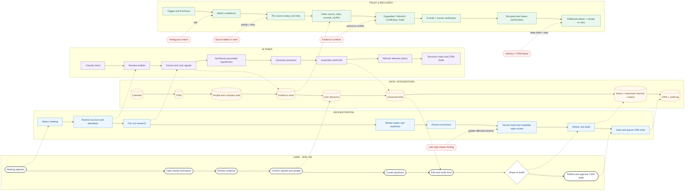

# Sprint 2 — Service Blueprint

> **Product:** Notion SDR Meeting Preparation Agent  
> **Experience promise:** Turn a booked discovery meeting into a grounded, editable, meeting-ready brief in under five minutes—without hiding uncertainty or writing to customer systems without review.  
> **Blueprint scope:** Meeting detection → progressive research → preparation → brief delivery → post-meeting reflection and CRM handoff.

> **Implementation boundary:** The diagram and Sections 2–8 define the target production service contract. They intentionally include orchestration, persistence, integrations, provenance, delivery receipts, and failure recovery that are not implemented in the release-candidate prototype. Section 9 is the source of truth for demonstrated prototype behavior.



> Editable full-size diagram: [`sprint-2-service-blueprint.mmd`](./sprint-2-service-blueprint.mmd). The embedded diagram above is the current Markdown reference; regenerate the standalone source after terminology changes. Paste it into Mermaid Live, Notion, GitHub, or diagrams.net (**Arrange → Insert → Advanced → Mermaid**) to restyle or export it.

## 1. Blueprint at a glance

The service has two linked loops:

1. **Prepare with evidence.** Detect the meeting, resolve the account and people, research in parallel, let the SDR work from partial results, and assemble a cited brief.
2. **Learn with control.** Capture what happened, ask the SDR to label the agent’s assumptions, draft structured CRM updates, and require an explicit approve/edit/discard decision.

The five readiness gates are **research complete, priority signals reviewed, stakeholders confirmed, discovery plan curated, and meeting brief reviewed**. Sharing is permitted before all five are complete only when the artifact is visibly labeled as a draft and the recipient and incomplete state are confirmed.

### Service principles

- **Useful before complete:** completed research becomes available immediately; one slow source does not block the workspace.
- **Claims, not vibes:** consequential synthesis carries claim-level evidence, freshness, and uncertainty—not only a source count.
- **Human decisions are durable inputs:** edits, role corrections, question choices, and assumption labels constrain downstream generation.
- **Review follows change:** a material late finding or user edit invalidates the affected review state and identifies what changed.
- **No silent side effects:** in the target service, sharing, exporting, and CRM writes return a real receipt or a recoverable failure state. The current prototype instead labels these actions as simulations.
- **Permission-aware by design:** every retrieval and write respects the user’s source permissions and is represented in the audit trail.

## 2. End-to-end service blueprint

| Layer | 0. Trigger | 1. Resolve context | 2. Research progressively | 3. Review and confirm | 4. Curate discovery | 5. Build and verify brief | 6. Deliver and become ready | 7. Reflect and update CRM |
|---|---|---|---|---|---|---|---|---|
| **User actions** | Books or receives a calendar meeting. | Opens the workspace; checks meeting, account, and attendee identity. | Reviews completed cards while remaining sources update. | Reviews signals; corrects or confirms each stakeholder role. | Selects at least three suggested questions or adds custom ones. | Generates a partial or complete brief; edits, removes, adds, and reorders sections; verifies important claims. | Keeps a draft, previews simulated Notion copy/export, or previews sharing with a fixed named teammate; marks the meeting ready once gates pass. | Records priorities, objections, and next steps; labels every assumption; edits, approves, or discards the CRM draft; completes reflection. |
| **Visible service / UI** | Meeting appears in Today with time, attendees, and preparation status. | Header shows matched company, attendees, and sample-source freshness. | The prototype banner exposes overall progress plus per-source Updating or Complete states; Failed and Stale are target-state additions. Cards stream in without layout loss. | Readiness panel routes to the next incomplete action. Signals show impact, source, timing, and confidence. Stakeholder roles are editable with Unknown available. | Recommended sequence explains why each question matters; the three-question minimum is visible and recoverable. | Brief is labeled as a demonstration AI draft and supports contextual editing plus pointer and keyboard reordering; changed-section marking and production citations remain target-state. | Confirmation names Devon Scott, warns when preparation is incomplete, and explicitly says nothing will be sent. Destination links and delivery receipts remain target-state. | Reflection progress shows explicit prerequisites. Completion is durable and timestamped and clears the Due badge; external CRM application remains simulated. |
| **Orchestration / system** | Subscribe to calendar changes; create an idempotent preparation job. | Normalize domains and identities; match calendar participants to CRM/contact records; request clarification below threshold. | Fan out connector jobs; stream events; cache results; isolate failures; retry with backoff; stop superseded jobs. | Merge results into a versioned evidence graph; calculate the five readiness gates; persist user confirmations. | Persist selections and custom questions; pass them as constraints to brief generation. | Assemble a versioned draft; diff late evidence; update only affected sections; invalidate stale review when meaning changes. | Apply channel-specific delivery; notify collaborators; record actor, version, destination, and outcome; never equate “clicked” with “sent.” | Trigger a post-meeting task; structure notes; gate external writes; queue an idempotent CRM mutation; store receipt and completion record. |
| **AI tasks** | Classify meeting type and infer preparation template. | Resolve account, people, roles, and relationship context; surface alternatives when uncertain. | Extract events and facts; deduplicate; rank relevance and impact; detect contradictions; summarize only supported claims. | Produce a why-now narrative, stakeholder hypotheses, suggested opening angle, and readiness recommendations. | Generate and sequence questions grounded in meeting goal, signals, stakeholders, and user choices. | Compose objective, why now, people, questions, and recommended angle with citations; preserve user-authored text. | Summarize the delivered version; do not autonomously decide readiness or recipient. | Map notes to CRM schema; compare outcomes with prior assumptions; propose future ranking adjustments without overwriting source facts. |
| **Data sources / records** | Calendar event, organizer, attendees, timing, conferencing metadata. | CRM account/contact/opportunity/activity; user/team identity and permissions. | Company site/blog, approved people source, careers pages, CRM history, approved internal Notion context, retrieval timestamps. | Evidence objects, claim graph, user corrections, review events, readiness state. | Question library, selected/custom questions, meeting objective, stakeholder map. | Versioned research snapshot, user edits, citations, brief versions, private notes. | Notion page, collaboration/notification channel, export store, audit log. | Meeting outcome and user notes, assumption labels, CRM draft, CRM mutation receipt, learning events. |
| **Failure and recovery** | Duplicate/rescheduled/canceled event → update or cancel the existing job, not create another. | No match or several plausible matches → pause account-specific synthesis and ask the SDR to choose; never guess silently. | Connector auth failure, timeout, rate limit, robots block, or stale result → keep partial workspace usable, identify the affected source, retry, and offer reconnect. | Conflicting or weak evidence → show both sides, lower confidence, and block definitive wording. User correction → retain correction and lineage. | Too few questions → keep Continue disabled and explain the minimum. Generation unavailable → preserve selections and offer retry/manual path. | Late high-impact evidence → flag changed sections. Unsupported model output → fail schema/grounding check and regenerate or omit. Save conflict → preserve both versions and ask. | Delivery denied/offline/failed → retain a versioned draft, show the actual failure, and retry idempotently. Never show a success toast without a receipt. | Incomplete assumptions → block approval. CRM validation/write failure → keep approved draft pending, identify rejected fields, allow repair/retry, and do not mark reflection complete. |
| **Confidence and provenance** | Show trigger source and last sync. | Show candidate match, matched identifiers, and match confidence; user confirmation becomes authoritative. | Every fact stores source identity, published/updated date, retrieval time, evidence excerpt, and permission context. | Each claim is labeled **Supported, Inferred, Conflicting, Stale, or Unavailable** with openable evidence and user-verification state. | Recommendation confidence is separate from factual confidence; explain which evidence and user goal caused the suggestion. | Citations survive synthesis into the brief; user-authored content is visibly distinct; edits keep a revision history. | Shared output freezes a source snapshot and version ID so collaborators see what was verified at send time. | Assumptions retain their original evidence plus the SDR’s Correct/Incorrect/Unknown label; CRM fields retain origin and approver. |
| **Output / handoff** | Preparation job and workspace shell. | Confirmed meeting context or a clarification task. | Research package with partial/completed source states. | Reviewed evidence set and confirmed buying-group model. | Curated discovery plan. | Reviewed, cited brief version. | Draft/shared/ready status plus delivery receipt. | Completed reflection, CRM receipt or discarded state, and bounded learning signals. |

## 3. Orchestration contract

### 3.1 State model

The UI should derive status from durable job and artifact state rather than timers or optimistic toasts.

| Object | Required states | Notes |
|---|---|---|
| **Preparation job** | `queued` → `resolving` → `researching` → `complete`; plus `partial`, `needs_input`, `failed`, `canceled` | `partial` is usable. A job is `complete` only when required sources have resolved or have explicit terminal exceptions. |
| **Source task** | `waiting`, `running`, `complete`, `stale`, `unavailable`, `failed`, `retrying` | Status is exposed per source; one source cannot falsely make the whole package look current. |
| **Claim** | `supported`, `inferred`, `conflicting`, `stale`, `unavailable`; plus `user_verified` or `user_corrected` | Claim status and recommendation confidence are separate concepts. |
| **Brief** | `draft`, `needs_review`, `reviewed`, `shared`, `ready`, `superseded` | A material source or content change moves `reviewed` back to `needs_review` for affected sections. |
| **Delivery** | `pending`, `succeeded`, `failed`, `retrying` | `succeeded` requires destination metadata and an external receipt or persisted artifact ID. |
| **Reflection** | `due`, `in_progress`, `blocked`, `complete` | Completion requires deliberate assumption labels and a terminal CRM decision (`approved` or `discarded`). |
| **CRM mutation** | `draft`, `editing`, `approved`, `queued`, `applied`, `rejected`, `discarded` | Approval is not the same as application. The interface must not conflate them. |

### 3.2 Refresh and invalidation rules

1. A late result is normalized into claims and compared with the current evidence graph.
2. Non-material metadata updates refresh provenance without disrupting the SDR.
3. A new or contradicted high-impact claim marks only dependent cards and brief sections as changed.
4. A material change invalidates review for those sections and explains the diff in plain language.
5. User-authored content is never silently overwritten; the system offers merge, keep mine, or accept update.
6. Shared versions remain immutable. New research creates a successor version and never rewrites what the AE previously received.

## 4. AI task and grounding map

| AI task | Inputs | Output | Validation / guardrail | Human control |
|---|---|---|---|---|
| Meeting classification | Calendar title, attendees, CRM opportunity stage | Meeting type and preparation template | Schema validation; low-confidence fallback to generic discovery template | SDR can change meeting goal/type. |
| Entity resolution | Domains, names, email addresses, CRM and calendar IDs | Ranked account/contact candidates | Exact-ID preference; threshold and ambiguity check; no synthesis on an unconfirmed low-confidence match | SDR selects or corrects the match. |
| Signal extraction | Approved source documents and metadata | Atomic fact/event candidates | Quote-span grounding, date extraction, deduplication, prompt-injection filtering | Target state: SDR can inspect, save, dismiss, or correct. The prototype currently supports filtering and saving only. |
| Impact ranking | Grounded facts, meeting goal, CRM stage | Priority and high-impact labels | Explainable feature set; no factual claim created by ranking | SDR reviews before readiness gate passes. |
| Stakeholder hypothesis | Attendee roles, activity, opportunity context | Suggested buying role and concern | Must be marked inferred unless directly recorded; Unknown allowed | Per-person edit and explicit confirmation. |
| Discovery planning | Confirmed context, selected signals, user goal | Suggested questions, sequence, rationale | Every rationale references relevant context; diversity and repetition checks | The prototype selects, removes, or adds questions; question reordering remains target-state. |
| Brief synthesis | Versioned evidence set, confirmed roles, selected questions, user text | Structured cited draft | Required citations for factual claims; unsupported text omitted/regenerated; user text protected | Target state: a genuinely generated, cited brief. The prototype uses fixed sample blocks and lets the SDR edit them and select **Complete brief review**. |
| Reflection structuring | SDR notes, prior assumptions, CRM schema | CRM field draft and comparison signals | Schema and field-policy validation; never write during generation | SDR labels assumptions and edits/approves/discards. |

## 5. Confidence and provenance specification

### 5.1 Claim record

Every displayed claim should be traceable to a record with at least:

```text
claim_id, claim_text, status, confidence_label
source_id, source_type, source_title, source_location
published_or_updated_at, retrieved_at, freshness_status
evidence_excerpt, relation: supports | contradicts
entity_match_id, model_or_rule_version
user_verification: unreviewed | verified | corrected
artifact_versions_using_claim[]
```

Sensitive excerpts should be permission-checked at view time; storing provenance does not grant broader access.

### 5.2 Confidence presentation

Use confidence as a **calibration aid**, not a claim of truth. Preserve the prototype’s plain-language pattern while making its basis inspectable:

| Label | Product meaning | Presentation rule |
|---|---|---|
| **High confidence** | Strong entity match, current authoritative or corroborated evidence, no material contradiction | May lead a card, but still exposes sources and remains editable. |
| **Good confidence** | Relevant evidence exists but is indirect, older, single-source, or partly inferred | State the inference and make verification easy. |
| **Early signal** | Weak match, limited evidence, or freshness concern | Never phrase as fact; use “may,” “appears,” or a question. |
| **Conflicting** | Credible evidence disagrees | Show the conflict; do not collapse it into a score or pick a winner silently. |
| **Unavailable / stale** | Evidence cannot be retrieved or is outside freshness policy | Say what is missing and when the last known evidence was retrieved. |

Confidence should consider source authority, entity-match quality, recency, corroboration, extraction certainty, and contradiction. The interface should expose the drivers rather than only a numeric percentage.

### 5.3 Evidence interaction

- Default view: concise claim, label, source count, and latest relevant date.
- Expanded view: one row per source with title, source system, date, direct location, and the evidence fragment used.
- Conflict view: supporting and contradicting evidence grouped separately.
- Shared brief: citations are frozen to the delivered version’s research snapshot.
- Correction view: the original suggestion and user correction remain linked for audit and evaluation.

## 6. Failure-state playbook

| Failure | User-facing behavior | System behavior | Safe fallback |
|---|---|---|---|
| Calendar event changed or canceled | Show the new time/state and what preparation was preserved. | Reconcile by external event ID; cancel or reschedule jobs idempotently. | Keep existing brief as a historical draft. |
| Account or attendee match ambiguous | Explain what could not be matched and show ranked choices. | Stop account-specific synthesis; log candidate basis. | Continue with calendar-only context after explicit consent. |
| Connector expired or permission denied | Name the connector and affected content; offer reconnect. | Do not repeatedly retry authorization errors. | Retain permitted partial results with freshness warnings. |
| Source times out or is rate-limited | Keep the workspace usable and show source-level status. | Backoff, retry, and honor deadlines. | Mark source unavailable; never imply research is fully current. |
| Source conflict | Display both claims and dates. | Preserve contradictory edges in evidence graph. | Turn the conflict into a discovery question. |
| Model produces an unsupported claim | Omit the claim and indicate that a section could not be grounded. | Fail grounding/schema validation; retry once with constrained evidence. | Offer a blank editable section. |
| New high-impact signal arrives after review | Highlight changed sections and explain why. | Create a new evidence/brief version; invalidate only dependent review. | Let the SDR keep their text and compare versions. |
| Save/version conflict | Show both versions and authors. | Preserve both; never last-write-wins silently. | Merge or choose a version. |
| Share/export fails | Say “not sent” and preserve recipient, note, and version. | Store failed delivery attempt with idempotency key. | Retry or copy a link manually. |
| CRM field validation or write fails | Keep the approved draft visible; identify rejected fields. | Move mutation to `rejected`, store response, never mark applied. | Edit and retry, or discard deliberately. |
| Reflection prerequisites incomplete | Name the remaining assumptions or CRM decision. | Block completion consistently. | Save progress and return later. |

## 7. Instrumentation and service measures

### Experience outcomes

- Median time from workspace open to reviewed brief; target: **under five minutes** for a standard discovery call.
- Preparation completion rate by each readiness gate, not only final Ready status.
- Percentage of users who inspect evidence for at least one high-impact claim.
- User correction rate by task: entity match, signal, stakeholder role, question, brief claim, and CRM field.
- Draft-share rate versus ready-share rate, with explicit confirmation completion.
- Reflection completion rate and time; assumption-label distribution; CRM approve/edit/discard rate.

### Reliability and trust measures

- Source-task success, latency, freshness, retry, and permission-denial rates by connector.
- Entity-match clarification rate and corrected-match rate.
- Claim groundedness, citation coverage, contradiction detection, and stale-evidence rate.
- Material late-update rate and percentage correctly invalidating dependent review.
- Delivery/CRM write receipt rate, duplicate-write rate, and recovery success.
- Calibration by confidence band: how often users verify or correct High, Good, and Early outputs.

Do not optimize only for fewer corrections. Corrections are valuable learning signals; the goal is well-calibrated, inspectable assistance and safe recovery.

## 8. Ownership and operational boundaries

| Capability | Primary owner | Required operational artifact |
|---|---|---|
| Calendar and CRM connectors | Integrations engineering | Connector health, scopes, retry policy, data contract |
| Research orchestration | Agent/platform engineering | Job state machine, deadlines, idempotency, event log |
| Evidence and provenance | AI platform + data | Claim/evidence schema, freshness policy, access checks |
| Prompt/model behavior | Applied AI | Versioned prompts, groundedness evaluations, red-team cases |
| Readiness and review UX | Product design + application engineering | Gate definitions, invalidation rules, accessibility criteria |
| Sharing and CRM writes | Application + integrations | Confirmation UX, audit log, receipts, rollback/retry runbook |
| Trust and privacy | Security/legal/product | Retention, tenant isolation, least privilege, incident process |
| Quality | Product analytics + research + QA | Evaluation set, usability plan, release dashboard |

## 9. Sprint 2 boundary and next build decisions

### Demonstrated in the current prototype

- Progressive research states across CRM, people, and company sources.
- Five-part meeting-readiness model and next-action routing.
- Signal review, per-person stakeholder role correction, question curation, editable brief, simulated fixed-teammate sharing disclosure, and post-meeting reflection.
- AI-draft labeling, confidence labels, compact source disclosure, deliberate assumption review, and controlled CRM draft approval.

### Service capabilities still required for a real beta

1. Replace timer-driven mock research with one real, permissioned, end-to-end data path.
2. Persist preparation, user edits, evidence, brief versions, review events, and reflection state.
3. Implement claim-level evidence with openable source location, date, excerpt, freshness, and conflict status.
4. Add connector and model failure states, timeouts, cancellation, retry, and recovery.
5. Require real delivery and CRM receipts before announcing success.
6. Add groundedness, citation, confidence-calibration, prompt-injection, privacy, and sensitive-data evaluations.
7. Add authentication, authorization, tenant isolation, retention controls, and auditability.

## 10. Source traceability and assumptions

This blueprint synthesizes the source material available in this checkout:

- [`README.md`](../README.md) for the product promise, prototype scope, and architecture.
- [`sprint-2-user-flows/Sprint2-User-Flows-Mermaid.md`](../sprint-2-user-flows/Sprint2-User-Flows-Mermaid.md) for the master journey and Flows 1, 2, 7, and 8.
- [`lib/meeting-readiness.ts`](../lib/meeting-readiness.ts) for the five readiness gates.
- [`lib/mock-data.ts`](../lib/mock-data.ts) and the implemented views for source types, AI outputs, edits, sharing, and reflection behavior.
- [`docs/formative-usability-evaluation.md`](./formative-usability-evaluation.md) for observed trust and control risks.
- [`docs/internal-alpha-test-report.md`](./internal-alpha-test-report.md) for production gaps and beta gates.

The PRD, UX spec, and discovery briefing are not present as standalone files in the current working tree or reachable commit history. Their intent is represented here only where it is carried forward into the prototype, user flows, and evaluation artifacts. Production-oriented orchestration, failure handling, provenance, and operational controls are clearly framed as the proposed service contract—not as capabilities already implemented.
