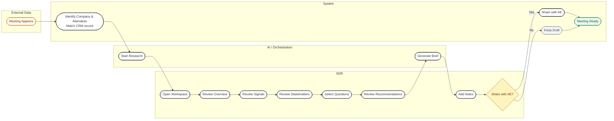
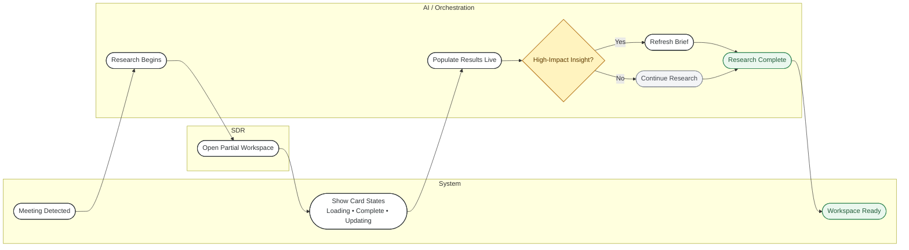
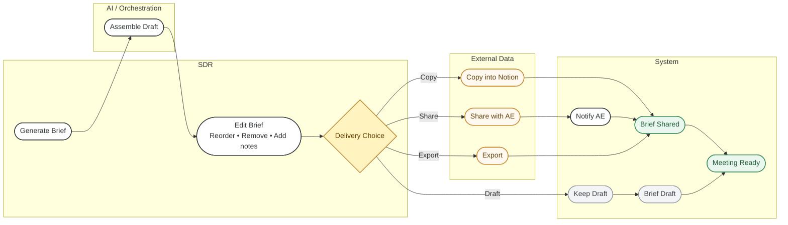
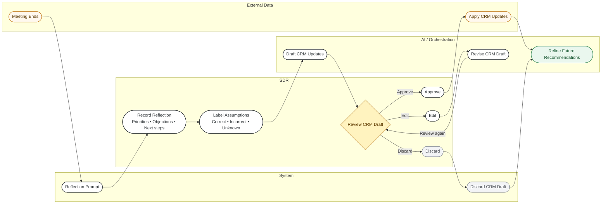

# Sprint 2 User Flows — Mermaid Source

Each block can be pasted into draw.io via **Arrange → Insert → Advanced → Mermaid**.

## Master Journey Map

```mermaid
flowchart LR
  subgraph SDR[SDR]
    direction LR
    overview([Overview]) --> signals([Signals]) --> stakeholders([Stakeholders]) --> questions([Discovery Questions]) --> recommendations([Recommendations]) --> brief([Meeting Brief])
    reflection([Post-Meeting Reflection])
  end
  subgraph SYS[System]
    direction LR
    detected([Meeting Detected])
  end
  subgraph AI[AI / Orchestration]
    direction LR
    research([Research Initiated])
  end
  subgraph EXT[External Data]
    direction LR
    calendar([Calendar])
    meeting([Meeting])
    crm([CRM Update])
  end
  calendar --> detected --> research --> overview
  brief --> meeting --> reflection --> crm
  class overview,signals,stakeholders,questions,recommendations,brief,reflection,detected,research action;
  class calendar,meeting external;
  class crm status;
classDef action fill:#FFFFFF,stroke:#2F3437,stroke-width:1.5px,color:#2F3437;
classDef decision fill:#FFF3BF,stroke:#B7791F,stroke-width:1.5px,color:#5F3B00;
classDef status fill:#EAF7EE,stroke:#3B8C5A,stroke-width:1.5px,color:#205C38;
classDef external fill:#FFF8EE,stroke:#C8872E,stroke-width:1.5px,color:#62420F;
classDef secondary fill:#F3F4F6,stroke:#8A9099,stroke-width:1.25px,color:#40454C;
```

## Flow 1: Prepare for a Discovery Call

## Flow 2: Research Still Running

## Flow 7: Build and Share Meeting Brief

## Flow 8: Post-Meeting Reflection

