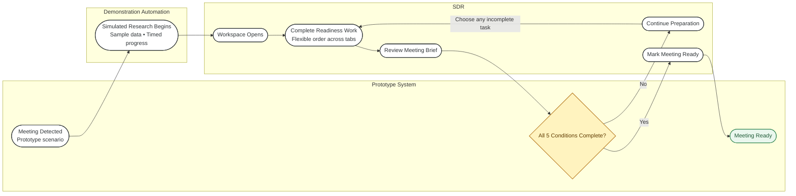
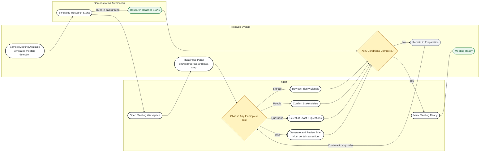
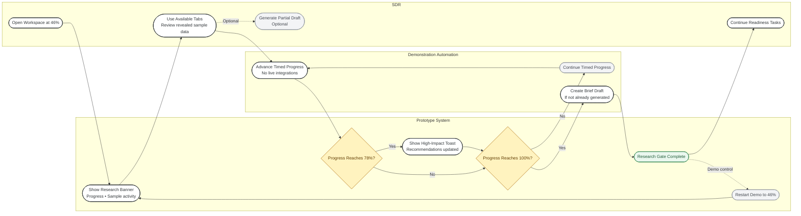
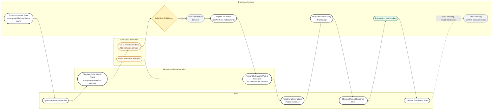
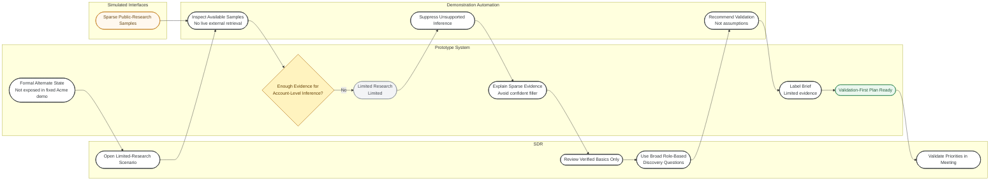
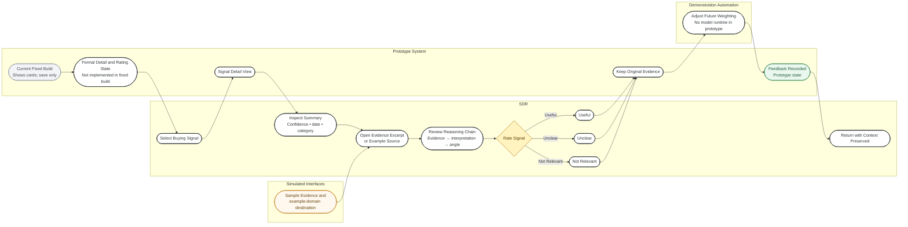
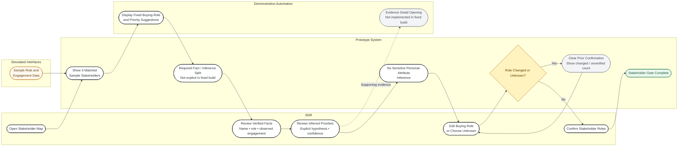
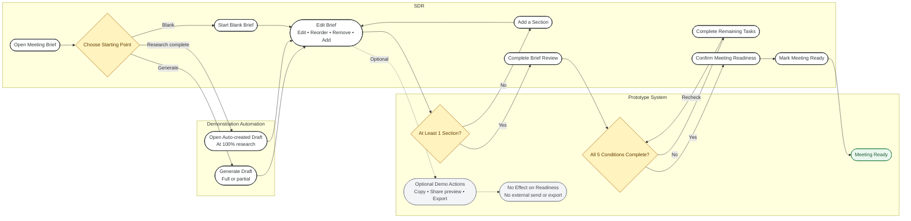
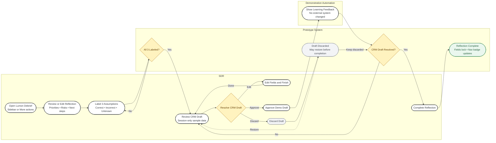

# Sprint 2 User Flows — Mermaid Source

These diagrams document the release-candidate prototype. Research, sharing, export, and CRM actions are simulated with sample data unless stated otherwise.

Meeting readiness has five conditions: research reaches 100%, priority signals are reviewed, stakeholders are confirmed, at least three discovery questions are selected, and a generated non-empty brief is reviewed. The user may work across tabs in any order; after all five conditions are complete, they separately confirm **Mark meeting ready**. Copy, share-preview, export, and reflection CRM actions do not make a meeting ready.

Post-meeting reflection is implemented as a separate Lumon sample debrief. It does not write to Salesforce or persist beyond the current prototype session.

Flows 3–6 are formal interaction contracts from the Sprint 2 User Flows document. Where the fixed Acme prototype does not expose the branch or interaction, the diagram says so explicitly; simulated CRM, research, and evidence surfaces are not production integrations.

Each block can be pasted into draw.io via **Arrange → Insert → Advanced → Mermaid**.

## Master Journey Map

## Flow 1: Prepare for a Discovery Call

## Flow 2: Research Still Running

## Flow 3: No CRM History

## Flow 4: Limited Public Research

## Flow 5: Review a Buying Signal

## Flow 6: Review Stakeholders

## Flow 7: Build and Share the Meeting Brief

## Flow 8: Post-Meeting Reflection and Learning

